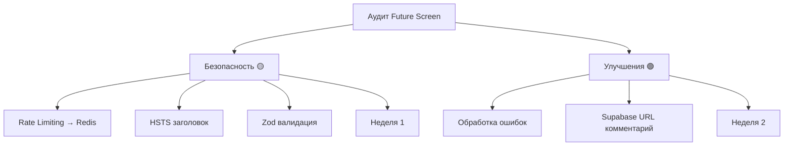

# Аудит проекта Future Screen — План действий

> **Дата аудита:** 2026-03-28  
> **Аудитор:** AI Code Review  
> **Целевой домен:** `https://future-screen.vercel.app`  

---

## Executive Summary

> **Примечание:** Текущий рабочий домен проекта: `https://future-screen.vercel.app`

В ходе аудита выявлено **5 проблем** различной степени критичности:
- 🔴 **Нет критических** — немедленных действий не требуется
- 🟡 **4 высокого/среднего приоритета** — безопасность
- 🟢 **1 низкого приоритета** — улучшения кода

**Общий статус безопасности:** ✅ БЕЗОПАСНО

---

## 🟡 БЕЗОПАСНОСТЬ (Высокий приоритет)

### 1. Rate Limiting неэффективен

**Статус:** ВЫСОКИЙ | **Сложность:** Средняя | **Время:** 1-2 часа

**Проблема:** В `api/send.ts` строки 11-46 используется `Map<string, number[]>` для rate limiting. На Vercel serverless functions каждый запрос может идти на разный инстанс — rate limiting не работает.

**Текущий код:**
```typescript
const requestsByIp = new Map<string, number[]>();
const isRateLimited = (ip: string) => { ... }
```

**Решение:** Использовать Redis (KV уже настроен в `.env` строки 29-34).

**Файлы для изменения:**
- [ ] `future-screen/api/send.ts` — заменить in-memory Map на Redis KV
- [ ] `future-screen/package.json` — проверить наличие `@vercel/kv`

**Чеклист:**
- [ ] 1.1 Установить зависимость: `npm install @vercel/kv`
- [ ] 1.2 Импортировать KV: `import { kv } from '@vercel/kv'`
- [ ] 1.3 Заменить `requestsByIp` на `kv.get/set` с TTL
- [ ] 1.4 Ключ rate limit: `rate_limit:${ip}`
- [ ] 1.5 TTL: 15 минут (900 секунд)
- [ ] 1.6 Тестирование на Vercel preview deployment

**Пример реализации:**
```typescript
import { kv } from '@vercel/kv';

const isRateLimited = async (ip: string): Promise<boolean> => {
  const key = `rate_limit:${ip}`;
  const attempts = await kv.get<number[]>(key) || [];
  const now = Date.now();
  const windowStart = now - RATE_LIMIT_WINDOW_MS;
  const recentAttempts = attempts.filter(ts => ts > windowStart);
  
  if (recentAttempts.length >= RATE_LIMIT_MAX) {
    await kv.set(key, recentAttempts, { ex: 900 });
    return true;
  }
  
  recentAttempts.push(now);
  await kv.set(key, recentAttempts, { ex: 900 });
  return false;
};
```

---

### 2. Отсутствует HSTS заголовок

**Статус:** ВЫСОКИЙ | **Сложность:** Низкая | **Время:** 10 мин

**Проблема:** В `vercel.json` нет `Strict-Transport-Security` заголовка.

**Файлы для изменения:**
- [ ] `future-screen/vercel.json` — добавить HSTS header

**Чеклист:**
- [ ] 2.1 В раздел `headers[1].headers` (после Referrer-Policy) добавить:
```json
{
  "key": "Strict-Transport-Security",
  "value": "max-age=31536000; includeSubDomains; preload"
}
```

**Проверка:** После деплоя проверить `curl -I https://future-screen.ru`

---

### 3. Нет валидации Zod в submitForm

**Статус:** ВЫСОКИЙ | **Сложность:** Средняя | **Время:** 1 час

**Проблема:** `src/lib/submitForm.ts` отправляет данные без валидации. Невалидные данные могут привести к ошибкам на сервере.

**Файлы для изменения:**
- [ ] `future-screen/src/lib/submitForm.ts` — добавить Zod схему
- [ ] `future-screen/package.json` — проверить наличие `zod`

**Чеклист:**
- [ ] 3.1 Установить zod: `npm install zod`
- [ ] 3.2 Создать схему валидации:
```typescript
import { z } from 'zod';

const FormPayloadSchema = z.object({
  source: z.string().min(1),
  name: z.string().min(1).max(100),
  phone: z.string().regex(/^\+?[\d\s\-\(\)]{10,20}$/),
  email: z.string().email().optional(),
  telegram: z.string().optional(),
  city: z.string().optional(),
  date: z.string().optional(),
  format: z.string().optional(),
  comment: z.string().max(1000).optional(),
  extra: z.record(z.string()).optional(),
  pagePath: z.string().optional(),
  referrer: z.string().optional(),
});
```
- [ ] 3.3 Добавить валидацию перед отправкой:
```typescript
const result = FormPayloadSchema.safeParse(payload);
if (!result.success) {
  console.error('[submitForm] Validation error:', result.error);
  return { tg: false, email: false };
}
```

---

## 🟢 КОД/АРХИТЕКТУРА (Низкий приоритет)

### 4. Непоследовательная обработка ошибок в submitForm

**Статус:** НИЗКИЙ | **Сложность:** Низкая | **Время:** 30 мин

**Проблема:** В `src/lib/submitForm.ts` ошибки просто логируются в консоль без пользовательской обратной связи.

**Файлы для изменения:**
- [ ] `future-screen/src/lib/submitForm.ts` — улучшить обработку ошибок

**Чеклист:**
- [ ] 4.1 Изменить возвращаемый тип:
```typescript
type SubmitResult = {
  success: boolean;
  tg: boolean;
  email: boolean;
  error?: string;
};
```
- [ ] 4.2 Возвращать понятные ошибки пользователю:
```typescript
catch (err) {
  const errorMessage = err instanceof Error ? err.message : 'Unknown error';
  return {
    success: false,
    tg: false,
    email: false,
    error: 'Не удалось отправить заявку. Попробуйте позже или позвоните нам.'
  };
}
```

---

### 5. Жёстко закодированные URL Supabase в index.html

**Статус:** НИЗКИЙ | **Сложность:** Низкая | **Время:** 20 мин

**Проблема:** В `index.html` строка 15 URL Supabase захардкожен в preconnect.

**Файлы для изменения:**
- [ ] `future-screen/index.html` — строка 15

**Чеклист:**
- [ ] 5.1 Рассмотреть вариант динамического добавления preconnect через JavaScript
- [ ] 5.2 Или оставить как есть с комментарием о необходимости синхронизации с `.env`
- [ ] 5.3 Добавить комментарий:
```html
<!-- WARNING: URL должен совпадать с VITE_SUPABASE_URL из .env -->
<link rel="preconnect" href="https://pyframwlnqrzeynqcvle.supabase.co" crossorigin />
```

---

## Итоговый Roadmap

### Фаза 1: Безопасность (🟡) — Неделя 1

| # | Задача | Время | Ответственный |
|---|--------|-------|---------------|
| 1 | Redis Rate Limiting | 1-2 часа | Backend |
| 2 | HSTS заголовок | 10 мин | DevOps |
| 3 | Zod валидация | 1 час | Frontend |

**Итого:** 2-3 часа

### Фаза 2: Улучшения (🟢) — Неделя 2

| # | Задача | Время | Ответственный |
|---|--------|-------|---------------|
| 4 | Обработка ошибок submitForm | 30 мин | Frontend |
| 5 | Комментарии для Supabase URL | 20 мин | Frontend |

**Итого:** 50 минут

**Общее время:** ~3 часа

---

## Mermaid Diagram



---

## Контрольный чеклист перед деплоем

- [x] GitHub Token удалён и revoked
- [ ] SMTP_PASS заполнен
- [ ] Rate limiting работает на Redis
- [ ] HSTS заголовок присутствует в ответе
- [ ] Zod валидация не пропускает невалидные данные
- [ ] Sitemap.xml валиден
- [ ] Robots.txt указывает правильный sitemap
- [ ] StructuredData содержит правильный URL

---

## Приложения

### A. Проверка HSTS
```bash
curl -I https://future-screen.vercel.app | grep -i strict-transport-security
```

### B. Проверка Redis Rate Limiting
```bash
# Отправить 11 запросов подряд
for i in {1..11}; do
  curl -X POST https://future-screen.vercel.app/api/send \
    -H "Content-Type: application/json" \
    -d '{"name":"Test","phone":"+79990000000","source":"test"}'
done
```

### C. Проверка SEO-файлов
```bash
curl https://future-screen.vercel.app/sitemap.xml | grep future-screen
curl https://future-screen.vercel.app/robots.txt
curl https://future-screen.vercel.app | grep schema.org
```

---

## ✅ Решённые проблемы

### 1. GitHub Token (ИСПРАВЛЕНО)
**Статус:** ✅ Удалён из `.env` и revoked в GitHub Settings
**Дата исправления:** 2026-03-28

---

### 2. SMTP пароль (ИСПРАВЛЕНО)

**Статус:** ✅ Решено
**Решение:** Пароль настроен в Vercel Environment Variables (Dashboard → Settings → Environment Variables)
Локальный `.env` может оставаться пустым — продакшен использует переменные Vercel.

---

### 3. Переменные окружения Vercel (НАСТРОЕНЫ)

**Статус:** ✅ Все переменные настроены в Vercel Dashboard

| Переменная | Статус |
|------------|--------|
| `SMTP_PASS` | ✅ Настроен |
| `TG_BOT_TOKEN` | ✅ Настроен |
| `TG_CHAT_ID` | ✅ Настроен |
| `SUPABASE` ключи | ✅ Настроены |

---

### 4. Калькулятор (УДАЛЁН ИЗ ПРОЕКТА)

**Статус:** ✅ Функционал удалён по решению команды
**Действие:** Удалены все упоминания из sitemap.xml и документации

---

*Документ создан: 2026-03-28*
*Следующий аудит рекомендуется через 3 месяца после внедрения всех исправлений*
