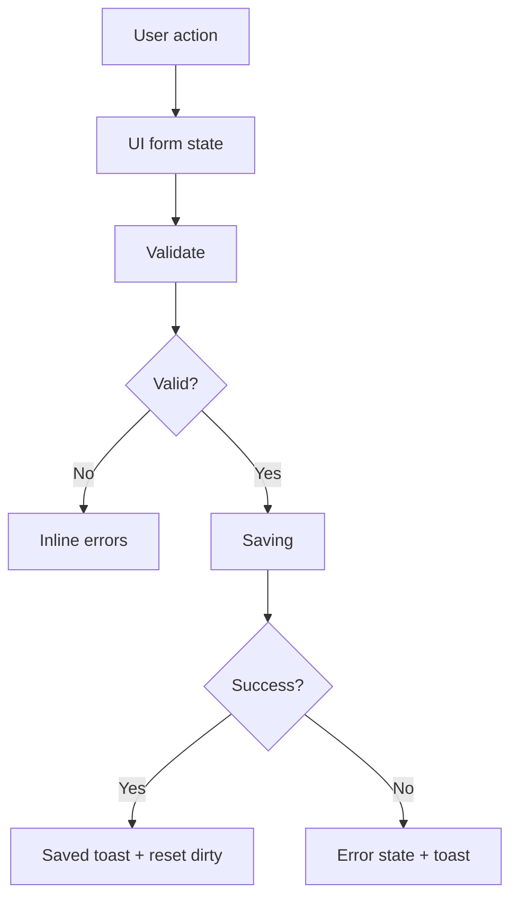

# План улучшения UX админки Future Screen

## Цель
Сделать админку быстрее, понятнее и единообразнее: один визуальный язык для форм/списков/ошибок/подтверждений и единый UX каркаса.

## Ключевые точки текущей админки
- Каркас/навигация: [`src/components/admin/AdminLayout.tsx`](src/components/admin/AdminLayout.tsx)
- Заявки: [`src/pages/admin/AdminLeadsPage.tsx`](src/pages/admin/AdminLeadsPage.tsx)
- CRUD сущности: [`src/pages/admin/AdminPackagesPage.tsx`](src/pages/admin/AdminPackagesPage.tsx), [`src/pages/admin/AdminCategoriesPage.tsx`](src/pages/admin/AdminCategoriesPage.tsx), [`src/pages/admin/AdminContactsPage.tsx`](src/pages/admin/AdminContactsPage.tsx)
- Калькулятор: [`src/pages/admin/AdminCalculatorPage.tsx`](src/pages/admin/AdminCalculatorPage.tsx)
- Кейсы/контент (несколько паттернов): [`src/pages/admin/AdminCasesPage.tsx`](src/pages/admin/AdminCasesPage.tsx), [`src/pages/admin/AdminCasesManagerPage.tsx`](src/pages/admin/AdminCasesManagerPage.tsx), [`src/pages/admin/AdminContentPage.tsx`](src/pages/admin/AdminContentPage.tsx)

## Deliverables

### 1) Единый UI-слой примитивов (создать в `src/components/admin/ui/`)
1. **Button**
   - `variant`: primary | secondary | danger | ghost
   - `size`: sm | md | lg
   - `loading`, `leftIcon`, `rightIcon`
2. **Input / Select / Textarea** (тонкие обёртки над `<input/>` и т.д.)
   - единые стили focus/disabled/error
3. **Field**
   - `label`, `hint`, `error`
4. **EmptyState**
   - `title`, `description`, `action?`
5. **LoadingState**
   - `title?`, `description?`
6. **ConfirmModal**
   - `title`, `description`, `confirmText`, `cancelText`
   - `danger?: boolean`
   - `onConfirm(): Promise<void> | void`

### 2) Единый каркас админки
В [`src/components/admin/AdminLayout.tsx`](src/components/admin/AdminLayout.tsx) привести:
- единый top-bar формат (заголовок, subtitle, actions)
- breadcrumbs (или хотя бы “контекст страницы”) для уменьшеия кликов
- sidebar UX для мобильных (закрытие при клике, focus trap/возврат фокуса)

### 3) Единый паттерн форм и сохранения
Для всех админ-форм ввести состояния:
- `idle` (ничего не делаем)
- `dirty` (есть несохранённые)
- `saving` (в процессе)
- `saved` (успех — toast + сброс dirty)
- `error` (ошибка — inline + toast)

### 4) Улучшение списков и карточек
Для списков заявок/кейсов:
- добавить toolbar-компоненты: поиск (debounce), фильтры, сортировка
- унифицировать карточку действия: primary action всегда на одном месте
- заменить разрозненные empty состояния на `EmptyState`

## Порядок работ (миграция без резких изменений)
1. Создать примитивы `ui/*` (минимальный функционал + единая стилизация)
2. Подключить `ConfirmModal` и `EmptyState` в 1–2 самых простых страницах
3. Обновить `Button/Input/Field` и постепенно заменять хардкод классы в формах
4. Затем перейти на сложные редакторы:
   - сначала `AdminPackagesPage`/`AdminCategoriesPage`/`AdminContactsPage`
   - затем `AdminCalculatorPage`
   - затем унифицировать паттерны в кейсах (`AdminCasesPage` vs `AdminCasesManagerPage` vs `AdminContentPage`)

## Критерии приёмки
- На каждой странице формы выглядят одинаково: label/hint/error
- Удаления везде подтверждаются единым UX через `ConfirmModal`
- Везде есть корректные empty/loading состояния
- На мобильных устройствах sidebar и основные действия доступны без лишних жестов

## Mermaid: целевой workflow UI

