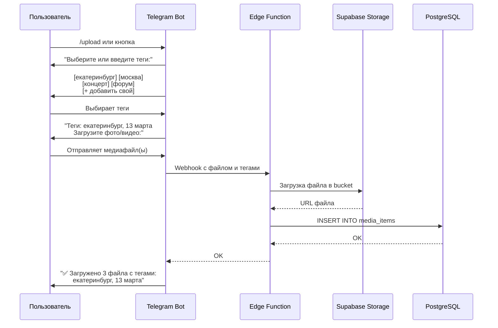

# План редизайна админки раздела "Кейсы"

## 📋 Общее описание задачи

Создание единого хранилища медиафайлов (фото и видео) с тегами, интеграция с Telegram ботом для загрузки, улучшенный интерфейс управления кейсами.

---

## 🗄️ Структура базы данных

### Таблица: `media_items`

Хранит все медиафайлы из библиотеки.

| Поле | Тип | Описание |
|------|-----|----------|
| `id` | UUID PRIMARY KEY | Уникальный ID файла |
| `name` | TEXT | Имя файла |
| `storage_path` | TEXT | Путь в Supabase Storage |
| `public_url` | TEXT | Публичный URL файла |
| `type` | ENUM('image', 'video') | Тип файла |
| `mime_type` | TEXT | MIME-тип (image/jpeg, video/mp4) |
| `size_bytes` | BIGINT | Размер файла в байтах |
| `tags` | TEXT[] | Массив тегов |
| `width` | INTEGER | Ширина (для изображений) |
| `height` | INTEGER | Высота (для изображений) |
| `duration` | INTEGER | Длительность в сек (для видео) |
| `thumbnail_url` | TEXT | URL превью (для видео) |
| `uploaded_by` | TEXT | Источник загрузки ('admin', 'telegram') |
| `telegram_message_id` | BIGINT | ID сообщения в Telegram (если загружено через бота) |
| `created_at` | TIMESTAMPTZ | Дата создания |
| `updated_at` | TIMESTAMPTZ | Дата обновления |

### Таблица: `case_media_links`

Связь кейсов с медиафайлами (many-to-many).

| Поле | Тип | Описание |
|------|-----|----------|
| `id` | UUID PRIMARY KEY | Уникальный ID связи |
| `case_id` | INTEGER FK → cases.id | ID кейса |
| `media_id` | UUID FK → media_items.id | ID медиафайла |
| `sort_order` | INTEGER | Порядок отображения |
| `created_at` | TIMESTAMPTZ | Дата создания |

### Схема связей

```mermaid
graph TD
    A[cases<br/>Таблица кейсов] -->|1:N| B[case_media_links<br/>Связующая таблица]
    B -->|N:1| C[media_items<br/>Медиа-библиотека]
    C --> D[tags<br/>Теги файлов]
    
    style A fill:#4a5568
    style B fill:#2d3748
    style C fill:#4a5568
    style D fill:#2d3748
```



---

## 🎨 UI/UX Концепция интерфейса

### Структура страницы админки Кейсы

```
┌─────────────────────────────────────────────────────────────────┐
│  📁 КЕЙСЫ                              [Табы: Кейсы | Медиа]   │
├─────────────────────────────────────────────────────────────────┤
│                                                                  │
│  ┌─────────────────────────────────────────────────────────┐   │
│  │  🔍 Поиск...    │  Фильтр по тегам ▼  │  [+ Добавить кейс]  │
│  └─────────────────────────────────────────────────────────┘   │
│                                                                  │
│  ┌─────────────────────────────────────────────────────────┐   │
│  │  📸 Форум в Екатеринбурге                     [✏️][🗑️] │   │
│  │  ━━━━━━━━━━━━━━━━━━━━━━━━━━━━━━━━━━━━━━━━━━━━━━━━━━━━  │   │
│  │  🏙️ Екатеринбург  •  📅 2024  •  🎭 Форум              │   │
│  │  📎 12 фото  •  🎬 3 видео                               │   │
│  │  🏷️ LED, Звук, Свет                                     │   │
│  └─────────────────────────────────────────────────────────┘   │
│                                                                  │
│  ┌─────────────────────────────────────────────────────────┐   │
│  │  🎤 Городской концерт                         [✏️][🗑️] │   │
│  │  ━━━━━━━━━━━━━━━━━━━━━━━━━━━━━━━━━━━━━━━━━━━━━━━━━━━━  │   │
│  │  🏙️ Тюмень  •  📅 2023  •  🎤 Концерт                  │   │
│  │  📎 8 фото  •  🎬 1 видео                                │   │
│  │  🏷️ LED, Звук, Сцена                                    │   │
│  └─────────────────────────────────────────────────────────┘   │
│                                                                  │
└─────────────────────────────────────────────────────────────────┘
```

### Вкладка "Медиа-библиотека"

```
┌─────────────────────────────────────────────────────────────────┐
│  📁 МЕДИА-БИБЛИОТЕКА                    [Табы: Кейсы | Медиа]  │
├─────────────────────────────────────────────────────────────────┤
│                                                                  │
│  ┌─────────────────────────────────────────────────────────┐   │
│  │  🔍 Поиск...  │  🏷️ Все теги ▼  │  📁 Загрузить файлы    │
│  │             [image] [video] [Все типы]                   │
│  └─────────────────────────────────────────────────────────┘   │
│                                                                  │
│  Групповые операции:  [Выбрано: 5]  [🏷️ Добавить тег] [🗑️ Удалить]│
│                                                                  │
│  ┌─────────────┐ ┌─────────────┐ ┌─────────────┐ ┌──────────┐  │
│  │ ☑️          │ │ ☑️          │ │ ☐           │ │ ☐        │  │
│  │  ┌───────┐  │ │  ┌───────┐  │ │  ┌───────┐  │ │ ┌──────┐ │  │
│  │  │       │  │ │  │  🎬  │  │ │  │       │  │ │ │      │ │  │
│  │  │  📸   │  │ │  │ VIDEO│  │ │  │  📸   │  │ │ │ 📸   │ │  │
│  │  │       │  │ │  │      │  │ │  │       │  │ │ │      │ │  │
│  │  └───────┘  │ │  └───────┘  │ │  └───────┘  │ │ └──────┘ │  │
│  │  🏷️ форум   │ │  🏷️ форум   │ │  🏷️ концерт│ │ 🏷️ экпо  │  │
│  │  🏷️ 2024    │ │  🏷️ 2024    │ │  🏷️ 2023   │ │ 🏷️ 2024  │  │
│  │  [✏️][🗑️]   │ │  [✏️][🗑️]   │ │  [✏️][🗑️]  │ │ [✏️][🗑] │  │
│  └─────────────┘ └─────────────┘ └─────────────┘ └──────────┘  │
│                                                                  │
│  ┌─────────────┐ ┌─────────────┐ ┌─────────────┐ ┌──────────┐  │
│  │ ☐           │ │ ☐           │ │ ☐           │ │ ☐        │  │
│  │  ┌───────┐  │ │  ┌───────┐  │ │  ┌───────┐  │ │ ┌──────┐ │  │
│  │  │  🎬   │  │ │  │       │  │ │  │       │  │ │ │  🎬  │ │  │
│  │  │ VIDEO │  │ │  │  📸   │  │ │  │  📸   │  │ │ │VIDEO │ │  │
│  │  │       │  │ │  │       │  │ │  │       │  │ │ │      │ │  │
│  │  └───────┘  │ │  └───────┘  │ │  └───────┘  │ │ └──────┘ │  │
│  │  🏷️ свадьба │ │  🏷️ конферен│ │  🏷️ тимбилд│ │ 🏷️ фест  │  │
│  │  🏷️ 2024    │ │  🏷️ 2024    │ │  🏷️ 2023   │ │ 🏷️ 2023  │  │
│  └─────────────┘ └─────────────┘ └─────────────┘ └──────────┘  │
│                                                                  │
└─────────────────────────────────────────────────────────────────┘
```

### Модальное окно загрузки файлов

```
┌─────────────────────────────────────────────────────────┐
│  📁 Загрузка файлов                            [X]      │
├─────────────────────────────────────────────────────────┤
│                                                          │
│  🏷️ Теги для файлов:                                    │
│  ┌─────────────────────────────────────────────────┐   │
│  │  [екатеринбург] [13 марта] [экспоцентр] [+][] │   │
│  └─────────────────────────────────────────────────┘   │
│  Введите теги через запятую или выберите существующие     │
│                                                          │
│  📤 Перетащите файлы сюда или нажмите для выбора:        │
│  ┌─────────────────────────────────────────────────┐   │
│  │                                                 │   │
│  │           📁  Перетащите файлы сюда            │   │
│  │                                                 │   │
│  │          JPG, PNG, GIF, MP4, WEBM, MOV          │   │
│  │                                                 │   │
│  └─────────────────────────────────────────────────┘   │
│                                                          │
│  📋 Выбранные файлы (3):                                 │
│  ┌─────────────────────────────────────────────────────┐ │
│  │ 🖼️ DSC_001.jpg          2.4 MB    [✓ готов]  [❌]  │ │
│  │ 🖼️ DSC_002.jpg          1.8 MB    [✓ готов]  [❌]  │ │
│  │ 🎬 video_001.mp4       15.2 MB    [⏳ загрузка]    │ │
│  └─────────────────────────────────────────────────────┘ │
│                                                          │
│  📊 Сжатие: оригинал 45.2 MB → 8.4 MB (81% сжатие)      │
│                                                          │
│           [Отмена]           [✓ Загрузить файлы]        │
│                                                          │
└─────────────────────────────────────────────────────────┘
```

---

## 🤖 Telegram Bot - Сценарий работы

### Последовательность действий



### Команды бота

| Команда | Описание |
|---------|----------|
| `/upload` | Начать процесс загрузки медиафайлов |
| `/tags` | Показать популярные теги |
| `/help` | Справка по использованию |

---

## 🏗️ Архитектура Edge Function для Telegram

### Файл: `supabase/functions/telegram-bot/index.ts`

```typescript
// Основной обработчик webhook
interface Update {
  message?: {
    message_id: number;
    chat: { id: number };
    text?: string;
    photo?: PhotoSize[];
    video?: Video;
    document?: Document;
  };
  callback_query?: CallbackQuery;
}

// Состояния пользователя в Redis/Supabase
interface UserState {
  chat_id: number;
  state: 'idle' | 'awaiting_tags' | 'awaiting_files';
  selected_tags: string[];
  temp_message_ids: number[];
}

// Обработчики:
// 1. handleStart(upload) - показать выбор тегов
// 2. handleTagSelection - сохранить выбранные теги
// 3. handleCustomTag - добавить свой тег
// 4. handleFileUpload - загрузка файла, сохранение в БД
```

---

## 📁 Структура файлов проекта

### Новые файлы

```
src/
├── components/
│   └── admin/
│       ├── cases/
│       │   ├── CasesList.tsx          # Список кейсов с карточками
│       │   ├── CaseEditor.tsx         # Форма создания/редактирования кейса
│       │   ├── CaseMediaSelector.tsx  # Выбор медиа из библиотеки
│       │   └── CasesTabs.tsx          # Вкладки Кейсы/Медиа
│       └── media/
│           ├── MediaLibrary.tsx       # Галерея медиафайлов
│           ├── MediaUploadModal.tsx   # Модалка загрузки файлов
│           ├── MediaCard.tsx          # Карточка медиафайла
│           ├── MediaTagFilter.tsx     # Фильтр по тегам
│           ├── MediaBulkActions.tsx   # Групповые операции
│           └── MediaTagEditor.tsx     # Редактор тегов
├── hooks/
│   ├── useMediaLibrary.ts
│   └── useMediaUpload.ts
├── queries/
│   └── mediaLibrary.ts
├── types/
│   └── media.ts
└── lib/
    └── mediaHelpers.ts

supabase/
├── functions/
│   └── telegram-bot/
│       ├── index.ts
│       ├── handlers.ts
│       └── supabaseClient.ts
└── migrations/
    └── 20260403_media_library.sql
```

---

## 🔧 Технические детали

### RLS Политики

```sql
-- Чтение медиа для всех (публичная библиотека)
CREATE POLICY "Public read media_items"
  ON media_items FOR SELECT USING (true);

-- Изменение только для админов
CREATE POLICY "Admin manage media_items"
  ON media_items FOR ALL 
  USING (auth.role() = 'authenticated');

-- Аналогично для case_media_links
```

### Индексы для производительности

```sql
-- Поиск по тегам
CREATE INDEX idx_media_items_tags ON media_items USING GIN(tags);

-- Фильтрация по типу
CREATE INDEX idx_media_items_type ON media_items(type);

-- Поиск по имени
CREATE INDEX idx_media_items_name ON media_items(name);

-- Сортировка по дате
CREATE INDEX idx_media_items_created ON media_items(created_at DESC);
```

### Supabase Storage Buckets

```
media/
├── images/         # Изображения
│   └── {uuid}.jpg
├── videos/         # Видео
│   └── {uuid}.mp4
└── thumbnails/     # Превью видео
    └── {uuid}.jpg
```

### Environment Variables

```
# Telegram Bot
TELEGRAM_BOT_TOKEN=xxx
TELEGRAM_WEBHOOK_SECRET=xxx

# Supabase (для Edge Function)
SUPABASE_URL=xxx
SUPABASE_SERVICE_ROLE_KEY=xxx
```

---

## 📋 Порядок реализации

### Этап 1: База данных и API (2-3 часа)
1. Создать миграцию таблиц
2. Создать типы TypeScript
3. Создать React Query hooks
4. Создать сервис для загрузки файлов

### Этап 2: UI Медиа-библиотеки (3-4 часа)
1. Создать компоненты галереи
2. Реализовать загрузку с drag-and-drop
3. Сделать фильтрацию по тегам
4. Добавить групповые операции

### Этап 3: Интеграция с кейсами (2 часа)
1. Обновить форму кейса
2. Добавить выбор медиа из библиотеки
3. Обновить отображение списка кейсов

### Этап 4: Telegram Bot (3-4 часа)
1. Создать Edge Function
2. Реализовать диалог выбора тегов
3. Реализовать загрузку файлов
4. Настроить webhook

### Этап 5: Тестирование и доработки (2 часа)
1. Проверить все сценарии
2. Исправить баги
3. Обновить документацию

---

## ✅ Критерии приемки

- [ ] Пользователь может загружать фото и видео в медиа-библиотеку
- [ ] К каждому файлу можно добавить теги при загрузке
- [ ] Работает фильтрация по тегам в библиотеке
- [ ] Можно выделить несколько файлов и удалить/изменить теги
- [ ] Кейсы отображаются с количеством связанных медиафайлов
- [ ] Telegram бот принимает команду /upload и сохраняет файлы с тегами
- [ ] Все изменения синхронизируются между пользователями через React Query
